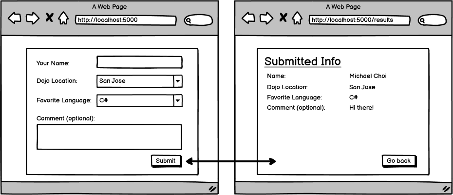

# Core Assignment: Dojo Survey

### Learning Objectives:

- Design a form that will trigger a POST request.
- Render data sent from a POST request on a View.

##

### Directions

Now that you've learned how to render pages, style them, use ViewBag, and handle post requests, your next assignment is to build an application that uses all these elements at once.

Use the wireframe below to build out a form and render the data from the form.

For the simplest version of this assignment, it is okay to render on the post request so that we can see the form data. For an advanced version, we will ask you to figure out how to render the data after leaving the post request.

- [ ] Build a form (don't forget to style it!)

- [x] Create a post request to handle the form data.

- [x] Level 1: Render the data on a results page on the post request.

- [ ] Level 2 (optional): Render the data on a results Get route (how could you hold on to the form data across a redirect?)

- [x] Create a "Go Back" button that sends you back to the first page.

- [x] Bonus: If the user did not fill out a comment, display "No comment" in gray text where the comment would be.
