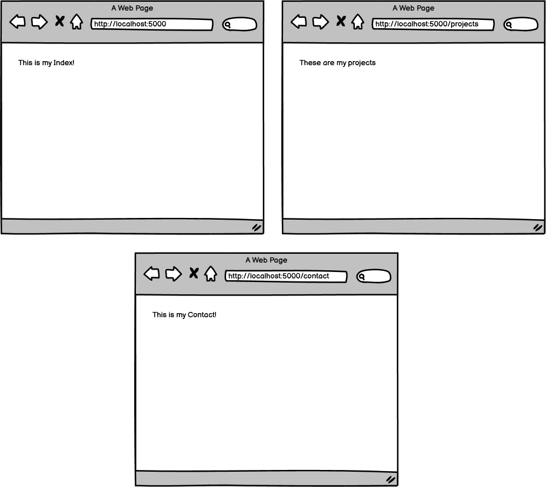

# Practice Assignment: Portfolio I

### Learning Objectives:

- Construct an ASP.NET Core project with an MVC structure.
- Build multiple routes in a Controller that return strings.

##

### Directions

Set up three basic routes for a portfolio page using the MVC structure. For now, the routes should return string values. We will revisit this project after learning how to render HTML pages.

- [x] Build an Index (front) route and render "This is my Index!"

- [x] Build a Projects route and render "These are my projects!"

- [x] Build a Contact route and render "This is my Contact!"
