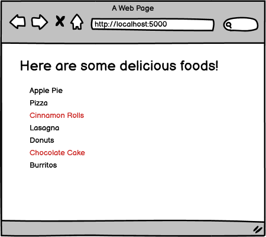

# Practice Assignment: Razor Fun!

### Learning Objectives:

- Render a View using Razor in a simple web application.
- Apply C# logic to render data on our View.
- Bonus: Apply conditional logic to affect how data renders.
##
### Directions
Using what you have learned about switching between C# logic and HTML, replicate the following wireframe. Create a new string List. Then iterate through the List. Generate a 
 tag for each iteration, and place the contents of the string from your List within the inner text of the 
 element.

Bonus: If the string in the List begins with the letter "c", style the 
 element with red text! (Do this using inline style for now since we have not gone over how to bring CSS files into our projects just yet.)

- [x] Create a web application that renders a cshtml page.

- [x] Add a List of strings to Index.cshtml using Razor.

- [x] Loop through the values in the List and print each one out in a p tag.

- [x] Bonus: If the string in the array begins with the letter "c", style the p element with red text.
