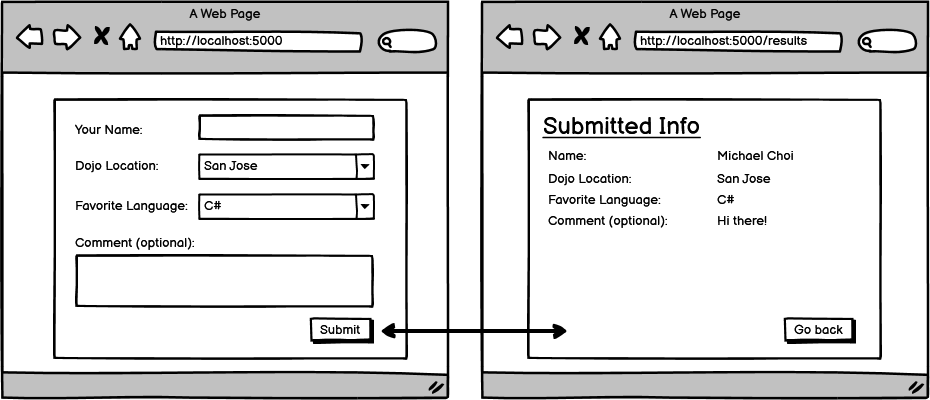

# Core Assignment: Dojo Survey with Validations

### Learning Objectives:

- Refactor code from previous projects.
- Apply form validations in an MVC application using Data Annotations and Models.
- Generate and render error messages that must be resolved to complete a post request.
##
### Directions
It's time to update our Dojo Survey assignment one last time. You have taken it from a simple form that sends data one piece at a time to a form that uses a model to build itself, and now you will finish it by adding validations and error messages.

As before, if you still do not have a way to persist the submitted data for longer than one request, it is okay to render the Results page on the post request. Just make sure if there are errors you're rendering the form instead so we can see error messages!

By this point, you also should have transferred your project from a web project to an MVC project. If you have not done this, now is the time.

Use the checklist below to add the appropriate validations.

- [x] Name, Location, and Favorite Language should all be required.

- [x] Name should be no less than 2 characters.

- [x] Comment isn't required, but if included, should be more than 20 characters.

- [x] If the submission is invalid, render errors.

- [x] If the submission is successful, render the results page.

- [x] Use ViewModel to display results.
