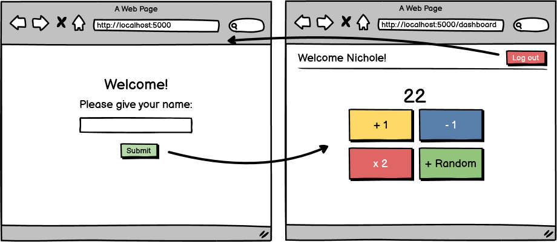

# Core Assignment: Session Workshop

### Learning Objectives:

- Create session instances to persist until session is cleared.
- Apply logical thinking skills to perform mathematical operations on a session value.
- Implement best practices to clear session for a user.
##
### Directions
Time to test out your newfound session skills by making and editing some session values! Use the wireframe and details below as a guide:

### Details:
- Users should be able to put their name in and have it remembered with session until log out.
- You can choose what number to start with on the dashboard. 22 is a good starting point.
    - + 1 should add 1 to the value above.
    - - 1 should subtract 1 from the value above.
    - x 2 should multiply the value by 2.
    - Random should add a random integer amount to the value between 1 and 10 (10 inclusive).
- Clicking "log out" should clear session and send the user back to the first page.
    - "Log out" should trigger a post request (this is best practice).
    - This action should clear the name and reset the number value.
- Bonus: Can you make it so that a user can only view the dashboard page if they have given their name?
- Challenge bonus: This assignment is easily done by making separate routes for each mathematical operation, but can you write it so that all actions that affect the value go through just one route? (Hint: Look up "hidden inputs")

- [x] User can input their name and have it be remembered by session

- [x] Establish a starting value

- [ ] Create functionality for +1, -1, x2 and +random

- [x] Implement logout feature

- [ ] Bonus: Add security to prevent a user from accessing the dashboard without inputting a name

- [x] Challenge: Rework logic to only use one route for mathematical operations
