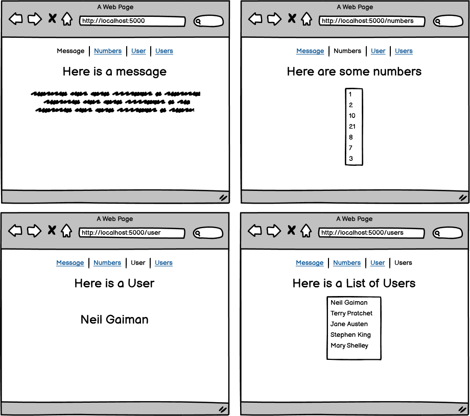

# Practice Assignment: ViewModel Fun

### Learning Objectives:

- Apply ViewModels to pass data from a Controller to a View.
- Build a Model to house an object.
##
### Directions
Create four pages that will each pass down a different ViewModel.

/ - Pass down a string that contains a message.

/numbers - Pass down an array of integers.

/user - Pass down a single User who has a first and last name (you will need to create a model for this).

/users - Pass down a List of Users and render their first and last names (using the User model you created earlier).

- [x] Render a page with a string model

- [x]  Render a page with an array of integers in a model

- [x]  Render a page with a single user

- [x]  Render a page with a List of users in a model

- [x]  Create a navbar that takes a user to each page