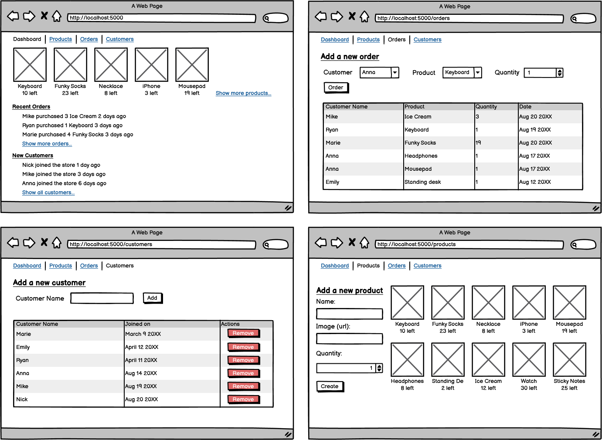

# Optional Assignment: E-Commerce

### Learning Objectives:

- Build a virtual storefront that simulates features from a real virtual store.
- Pull and render data using LINQ and EF Core.
##
### Directions
For this assignment, we are going to build a virtual storefront as a sort of capstone project. It will be a site that displays listings of products for sale with the ability to add customers who order those products. Following the wireframe below, try to replicate the functionality of an E-commerce website. Feel free to add your own features to build this into a more fleshed-out website!

You can download the wireframe to see all the details [here](asset/1663090395__E-Commerce.png).

- [ ] Create an order page where the user can add and view orders

- [ ] Create a customer page where the user can add, view, and delete customers

- [ ] Create a product page where the user can add and view products

- [ ] Create a dashboard that displays at least 3 of each item (orders, customers, and products) and links to the other pages
