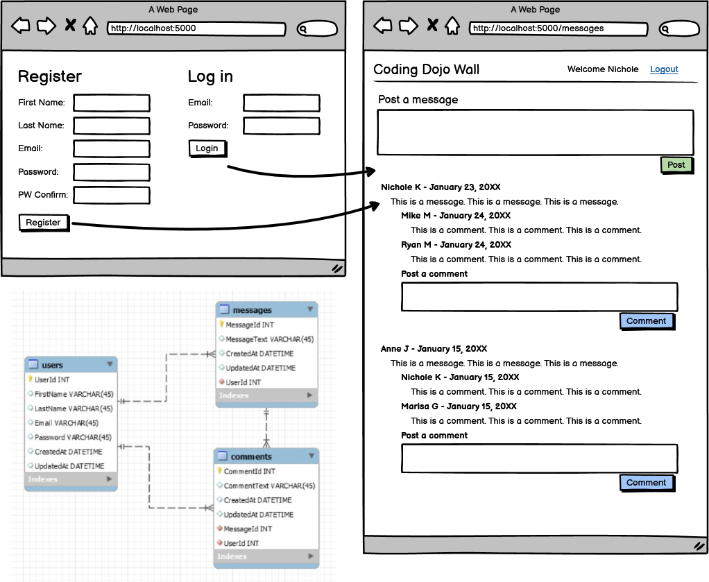

# Practice Assignment: The Wall

### Learning Objectives:

- Connect login and registration to an application that depends on a logged-in user.
- Build a database that relies heavily on relationships for functionality.
- Implement session for user authentication.
##
### Directions
Create a wall/forum page where users will be able to post a message and see the message displayed by other users. Store the messages in a table called 'messages' and retrieve the messages from the database. Have a Login and Registration page. After logging in, the user is directed to The Wall.

Recommended working order: Get the messages to show up like on the wireframe, then allow users to post comments for any message. Store the replies/comments to the message in a separate table called 'comments'.

Use validations from previous login and register assignments for this project. Feel free to try other validations as well like making it so names must contain only letters (no numbers or special characters) or requiring special characters or numbers when making a password.

**Posts**

- Post must have content
- Posts should be displayed with the newest post first
- Bonus: Be able to delete your post

**Comments**

- Comment must have content
- Comments should be displayed with the oldest comment first
- Bonus: Be able to delete your comment

Download the wireframe [here](asset/1663103446__TheWall.png).

- [x] User can login and register

- [ ] User can post a message (with validations)

- [ ] User can post a comment (with validations)

- [ ] Bonus: user can delete their post

- [ ] Bonus: user can delete their comment

- [x] User can logout