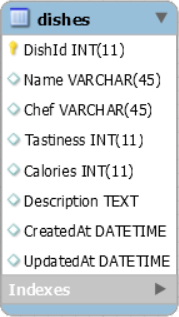

# Core Assignment: CRUDelicious

### Learning Objectives:

- Create an MVC application that connects to a MySQL database using Entity Framework Core.
- Perform CRUD commands using Entity Framework Core.
- Render data pulled from a MySQL database using EF Core and LINQ.

##

### Directions

Test out your new skills with CRUD features by building the following application. Use the wireframe below as a guide.

### Front Page

- Dishes should be displayed in reverse chronological order (newest dish first)

### Dish validations

- All fields are required
- Calories must be greater than 0
- Tastiness must be between 1 and 5

### Update Dish

- Make sure to update the UpdatedAt property upon successful edit

### Delete

- Use proper conventions for deleting
  Tip: It can be helpful to start with some test data so that you can begin working on each of the required features before needing to set up a front end for your create/edit forms. Execute a few INSERT statements on your Dishes table in MySQL Workbench/MySQL CLI so you have some initial data to work with!

**Dishes ERD**

**Wireframe**

- [x] Create a Dishes model

- [x] Connect to your MySQL database

- [x] Complete the front page

- [x] Be able to add a new dish using a form

- [x] Able to view a single dish on a page

- [x] Able to edit a dish and redirect back to the view one page

- [x] Able to delete a dish from the database

- [x] Follow RESTful routing standards
