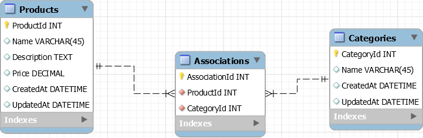
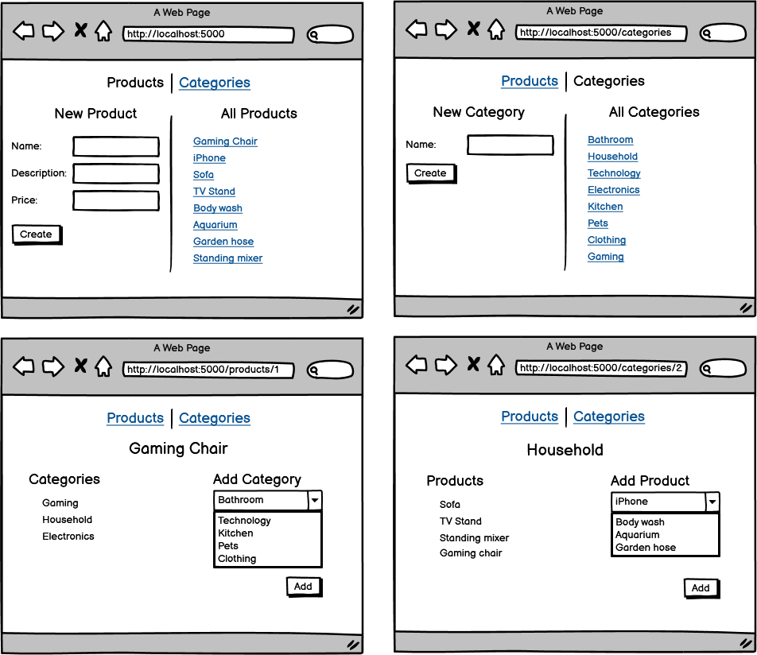

# Core Assignment: Products and Categories

### Learning Objectives:

- Construct a many-to-many relationship between models using Entity Framework Core.
- Pull relationship data between models using EF Core’s ThenInclude method.

##

### Directions

In this assignment, you will be creating an application that will keep track of products and the categories those products belong to. Use the wireframe and ERD provided to build the application and determine the relationship between models.

**Products and Categories validations**

- All fields are required
  **Products and Categories detail pages**
- When a category or product is connected, remove the reference from the dropdown. For example, if a product has the "Electronics" category attached to it, we should not see "Electronics" as an option in the dropdown when selecting other categories to attach to that particular product. (Tip: You will likely have to research how to do it or think carefully about how you could filter for this data!)
- Bonus: be able to delete an association between a product and a category.

### ERD and Wireframe

- [x] Able to add products to the database.

- [x] Able to add categories to the database.

- [x] Able to connect products and categories.

- [x] Render the products in one category.

- [x] Render the categories for one product.
<!-- make like wedding planner -->
- [ ] Ensure a user cannot add duplicate product/category associations.

- [ ] Bonus: able to delete an association between a product and a category.
